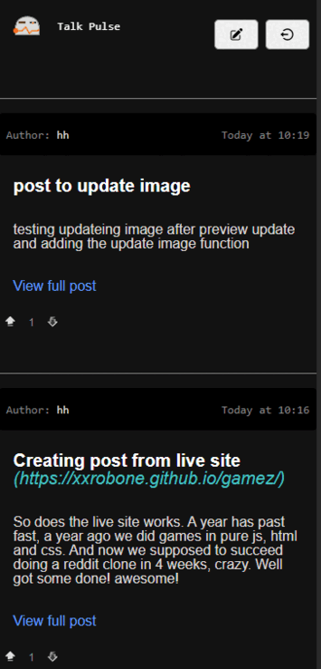

# TALK PULSE - SERVER (reddit clone)

## This is a school project MERN stack assignment

DEMO: https://talkpulse.onrender.com/

Hosted on Render, you can check their page here: https://render.com/

## Frontend for this project
Frontend part of the project: https://github.com/xxrobone/talkpulse-cme

# PREVIEW
### Talk Pulse App 


## Features included

### Reading posts no sign-in needed

### USER
- Sign up
- Sign in
- Auth using JsonWebTokens
- User email verification and reset password

### Posts (User log-in)
- User can create, update and delete own posts 
- "Real time" updates with React Router using loaders (reads) and actions (writes)

### Comment & Votes
- Comments and votes if user is signed in

## Features not included
- ~~Subreddits~~ 
- ~~Additional features or libraries for realtime like socket.io, websockets or swr~~

## ? Wanna try the project or use it as a start for something bigger or just play with the code feel free to do so ?

### Getting started

Clone the repo: (or fork it)

```sh
git clone https://github.com/xxrobone/talkpulse_server-cme.git
```
Install dependencies:

```sh
npm i
```
### You can use post man to try it out
To use auth and use the crud functionality to add posts, comment, vote - you need to be signed in

example of sign up
POST http://localhost:8000/signup
```sh
{
    "username": "yourname",
    "email": "your email",
    "password": "your password"
}
```
- You will then get a email for verification
- After verification is done you can sign in

example of sing in
POST http://localhost:8000/login
```sh
{
    "username": "yourname",
    "password": "your password"
}
```

- After you have and account and log in you will get a token in postman response
- Use the token in the Authorization tab choose - Bearer Token
- Next step is to create a post

example of creating a post
POST http://localhost:8000/posts
```sh
{
    "title": "Post title",
    "body": "post to body",
    "link": "https://example.com/" (optional)
    "image": "image is optional"
}

```
example of updating a post
PUT http://localhost:8000/posts/657ff161fe7794cf84a2f48c (just and example, the post id you got when you created the post)
```sh
{
    "title": "Update Post title",
    "body": "Update post to body",
    "link": "https://example.com/" (optional)
    "image": "image is optional"
}
```

DELETE http://localhost:8000/posts/657ff161fe7794cf84a2f48c (just and example, the post id you got when you created the post)
```sh
You dont need no body, only the post id in the params to delete the post
```
Comments and Votes work similar way you need the bearer token and the enpoints
You can find all routes in the routes folder in the files auth, comments, posts, votes, and users(not yet using it)

Then use the token in the Authorization tab choose - Bearer Token


### IF you want to try the project with the frontend
You can find the frontend here: https://github.com/xxrobone/talkpulse-cme

### There is docker compose file in this project you can use locally
To run docker:
 navigate to the folder that contains the docker-compose.yml file and run the command

 ```sh
docker-compose up -d 
``` 

Or create and account on the MongoDB follow there instructions on how to set it up
Here is a tutorial: https://www.mongodb.com/languages/express-mongodb-rest-api-tutorial

To Start the server:    
```sh
npm run dev
```

You need to set up your own .env file, check the file env.example to see which env variables are used in this project

## TECH USED IN THIS PROJECT:
- MongoDB – Database NoSql 
- NodeJs – Framework 
- Typescript
- Express - Server 
- Mongoose - As ODM handling data modelling
- JsonWebToken – Secure authentication 
- Bcrypt – For password hashing 
- Multer – For handling images 
- Nodemailer – Email verification and password reset
- Nodemon – for server restart on file change 
- Docker – for running mongoDB on local dev environment 

 - for images i choose to use base64 convertion and save it as a string (not the best way)


Folder file Structure (to follow, I might change it)

```
├── src
│   ├── controllers
│   │   ├── authController.ts
│   │   |── postController.ts
|   |   |── commentController.ts
|   |   |── userController.ts
|   |   |── votesController.ts
│   ├── middleware
│   │   └── authMiddleware.ts
│   ├── models
|   |   ├── user.model.ts
│   │   |── post.model.ts
|   |   |── comment.model.ts
│   ├── routes
|   |   ├── authRoutes.ts
│   │   |── postRoutests
|   |   |── commentRoutes.ts
|   |   |── userRoutes.ts
│   ├── helpers
│   │   └── helpers.ts
│   ├── types
│   │   └── types.ts
│   ├── utils
│   │   └── bcrypt as utils.ts (all utils functions)
│   └── index.ts
├── .env
├── package.json
└── tsconfig.json
```


Just my notes don't mind these...

TODO:
Verification [x] - working on live site
Password reset [x] - works on live site
Voting both comments and post [x] - works on live and local 

USER!
Password verification [x]
Password reset [x]

IMAGES! 
Add images [x]
Update images [x]

Future features // 

User logout after token expires or refresh token activation []

SUBREDDITS!
ADD model:              []
ADD controllers:        []
ADD routing:            []


REPLIES!
ADD model:              []
ADD controllers:        []
ADD routing:            []

USER!
User profile updates []